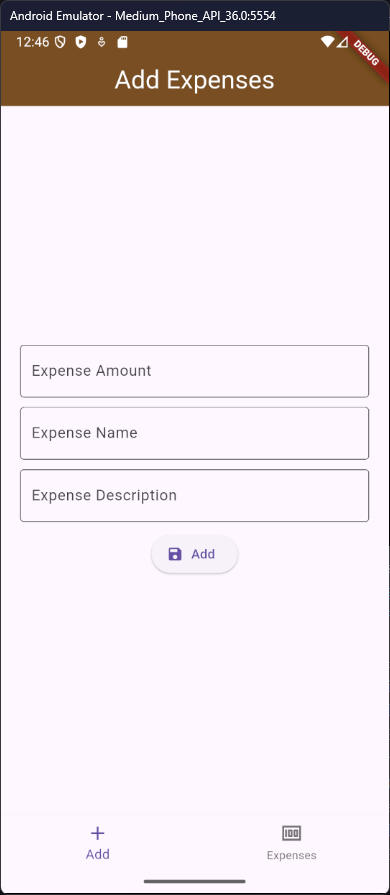
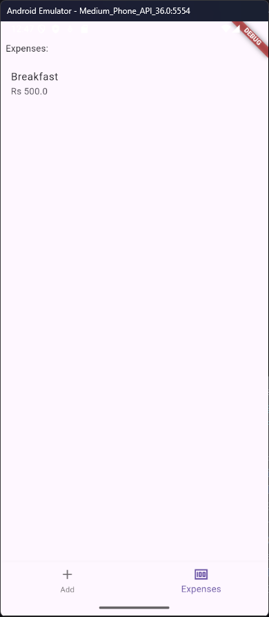
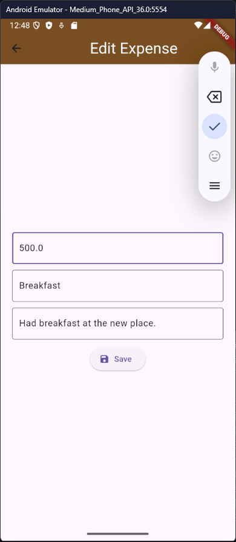

# Expense Tracker

A simple and intuitive web application to keep track of your personal expenses and manage your budget efficiently.

## Features

- Add, edit, and delete expenses
- Categorize expenses (e.g., Food, Transport, Utilities)
- Generate monthly and yearly reports
- Visualize spending with charts
- Responsive design for mobile and desktop

## Demo
<div style="display: flex; gap: 10px;">
  
  
  
</div>


Try it live: [Expense Tracker Demo](https://your-demo-url.com)

## Getting Started

### Prerequisites

- Node.js >= 18.x
- npm >= 9.x

### Installation

```bash
git clone https://github.com/Sujalcha7/Expense-Tracker.git
cd Expense-Tracker
npm install
```

### Running the App

```bash
npm start
```
The app will be available at `http://localhost:3000`.

## Usage

1. Register or log in.
2. Add your expenses with categories and amounts.
3. View summaries and visual reports.
4. Export your data as CSV.

## Contributing

Pull requests are welcome! For major changes, please open an issue first to discuss what you would like to change.

1. Fork the repo
2. Create your feature branch (`git checkout -b feature/AmazingFeature`)
3. Commit your changes (`git commit -m 'Add some AmazingFeature'`)
4. Push to the branch (`git push origin feature/AmazingFeature`)
5. Open a pull request

See [CONTRIBUTING.md](CONTRIBUTING.md) for more details.

## License

[MIT](LICENSE)

## Contact

Created by [@Sujalcha7](https://github.com/Sujalcha7) - feel free to reach out!
